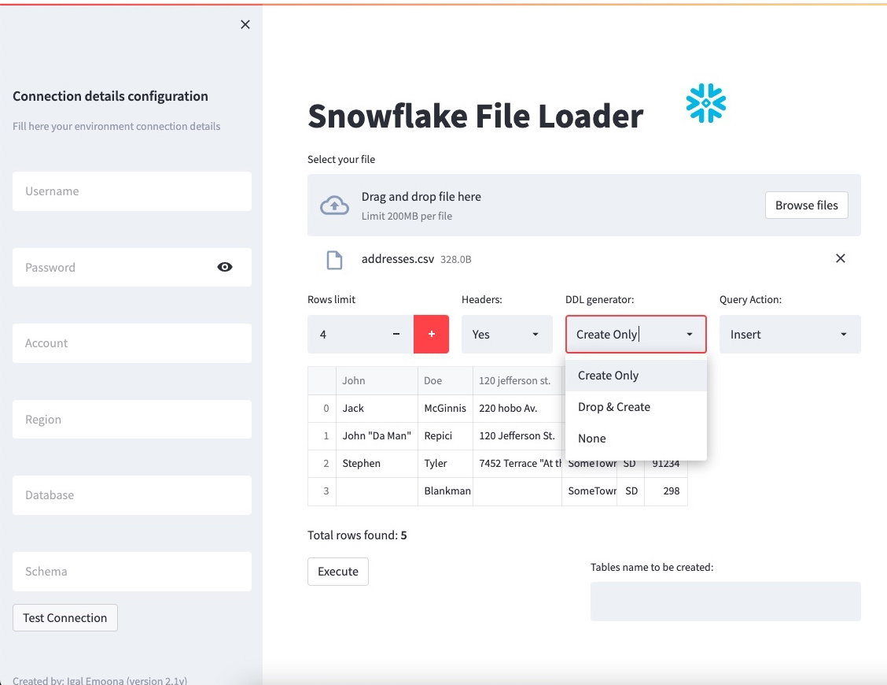

<p align="center" width="100%">
  
</p>

<p align="center" width="100%">
  
</p>

# Streaml-it
Streamlit applications project

Dynamic CSV -> Snowflake loader applicattion

## Getting started

**Open an Linux terminal and run locally instance type shell script:**

```sh
# How to run CSV loader app:
cd app
streamlit run main.py

```

You just ran the CSV loader application!! 🎉

Check out the terminal log ``output`` while running the app.

# Enjoy! 
